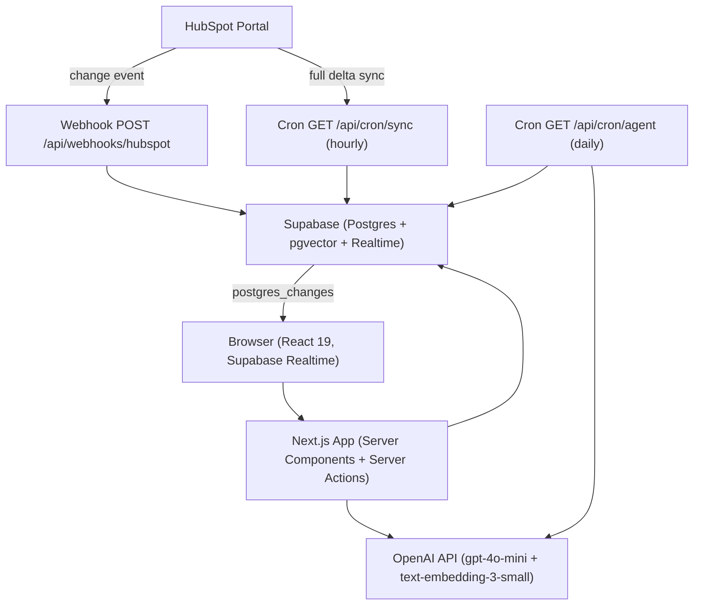
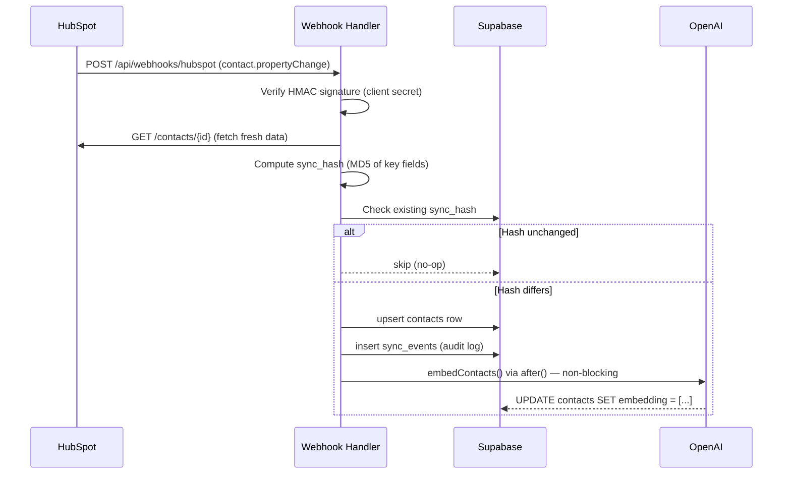
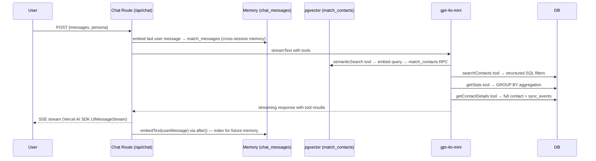
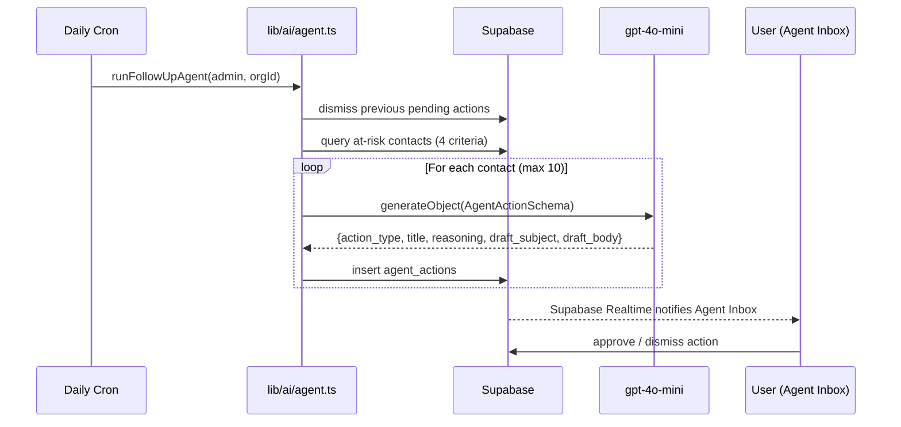

# ContactShip — Architecture

## System Overview

ContactShip is a multi-tenant AI-first CRM workspace that mirrors a HubSpot portal in real time, enriches contacts with vector embeddings, and exposes an autonomous AI agent layer on top of the data.



---

## HubSpot Sync Pipeline

Every contact change flows through a deterministic upsert with built-in deduplication:



**Key invariants:**
- `sync_hash` prevents duplicate writes when webhooks retry
- `local_updated_at` / `hubspot_updated_at` ordering decides conflict detection
- `sync_status` drives the conflict inbox and the realtime badge
- Embeddings are regenerated in background via Next.js `after()` — the sync response never waits on OpenAI

---

## RAG Pipeline (Chat)



**Cross-session memory:** User messages are embedded asynchronously and stored in `chat_messages.embedding`. Before each response, the system retrieves the 4 most semantically similar past messages and injects them as context. This gives the model continuity across sessions without managing long conversation histories.

---

## Autonomous Agent



**At-risk criteria:**
| Criterion | Threshold | Action type |
|---|---|---|
| Customer, no activity | > 60 days | `re_engagement` |
| SQL, no activity | > 14 days | `follow_up_email` |
| Opportunity, no activity | > 30 days | `follow_up_email` |
| New lead, unworked | > 7 days | `risk_alert` |

---

## Multi-tenant Security Model

Every table has Row Level Security (RLS) enforced at the database level:

```sql
-- Pattern used on all user-facing tables
(auth.jwt() -> 'app_metadata' ->> 'org_id')::uuid = org_id
```

- `org_id` is stored in JWT `app_metadata` (service-role-only — not writable by users) at signup and never changes
- Server Actions use `createServiceClient()` (service role) for writes; never exposed to the client
- User-facing queries use `createClient()` which respects RLS
- HubSpot OAuth tokens are stored as Supabase Vault secrets — never in plaintext columns
- CSRF protection on the HubSpot OAuth flow via `state` token in an httpOnly cookie

---

## Vector Search

Contacts and chat messages are embedded with `text-embedding-3-small` (1536 dimensions).

**Contacts index (pgvector IVFFlat):**
```sql
create index contacts_embedding_idx
  on public.contacts using ivfflat (embedding vector_cosine_ops)
  with (lists = 100);  -- sized for ~1M rows
```

The `match_contacts` RPC returns results above a configurable cosine similarity threshold. Threshold is tuned per use case:
- Chat semantic search: `0.35` (high recall, question answering)
- Similar contacts panel: `0.50` (moderate precision)
- Duplicate detection: `0.88` (high precision, only strong matches)

---

## Technology Decisions

| Decision | Choice | Why |
|---|---|---|
| Database + Realtime | Supabase | pgvector + Realtime in one service; RLS enforced at DB level |
| Vector index | IVFFlat (not HNSW) | Better write performance; suitable for < 1M rows with periodic reindex |
| AI models | `gpt-4o-mini` + `text-embedding-3-small` | Cost-optimized; structured outputs via Zod schemas for reliability |
| Embedding strategy | `after()` in background | Sync response never waits on OpenAI; graceful degradation if key is missing |
| Cache storage | `org_ai_cache` table | In-memory Map doesn't survive Vercel deploys or multi-instance deployments |
| Chat framework | Vercel AI SDK v6 (`streamText` + `createUIMessageStream`) | Tool calling + streaming in one API; SSE handled transparently |
| Auth | Supabase SSR (`@supabase/ssr`) | Session in cookies; middleware refreshes token transparently |
| i18n | Custom `createT()` with 481 keys (ES/EN) | No runtime dependency; trivial to extend; dialect-aware (rioplatense) |
| Testing | Vitest (unit) + Playwright (E2E) | Vitest for fast feedback on pure functions; Playwright for full-stack flows |

---

## Key Files

| Area | File |
|---|---|
| HubSpot sync | `lib/hubspot/sync.ts` |
| Embeddings | `lib/ai/embeddings.ts` |
| RAG retrieval | `lib/ai/chat.ts` |
| Cross-session memory | `lib/ai/memory.ts` |
| Insights generation | `lib/ai/insights.ts` |
| Autonomous agent | `lib/ai/agent.ts` |
| Chat streaming | `app/api/chat/route.ts` |
| Hourly sync cron | `app/api/cron/sync/route.ts` |
| Daily agent cron | `app/api/cron/agent/route.ts` |
| HubSpot webhook | `app/api/webhooks/hubspot/route.ts` |
| DB migrations | `supabase/migrations/` |
| Type definitions | `types/database.ts` |
